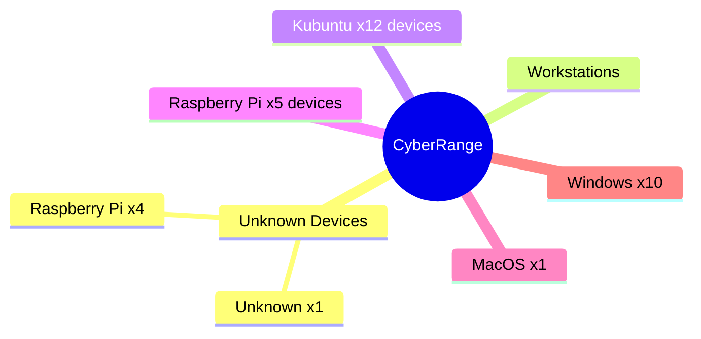

Your task is to prepare a report which details the devices and vulnerabilities on the Cyber Range network. This network is ‘airgapped’ (not connected to the internet), with numerous devices attached. The devices could range from PCs and laptops to Raspberry PI and Arduino-based devices. 

# Goal

There are reports of unauthorised users on the network. Your goal is to find the device that **Fulcrum** controls, which gives you the final piece of the puzzle.

# Network Mapping & Analysis

> Your task is to identify all the devices connected. Using network analysis tools, you will scan the network and present the information in a visual format. You may need to scan the network at different times over the course of the project to gain a complete network map.
> 
> 
> Identify and categorise the devices discovered through your scans, and analyse the network structure.
> 
> If you find suspicious devices, research as much as you can about the device, documenting your findings.
> 
> Consider how to present the information you collect - categorise and prioritise the data!
> 

Connect your device to the CyberRange network

<aside>
 SSID: CyberRange
Password: CyberRange

</aside>

Scan the network to create a list of all devices connected.

You will need to categorise each of the devices found. They could be workstations (Kubunutu, Raspberry Pis, windows, MacOS etc). 

Consider how to present this information within the document. You could create something such as this:

## **Device Vulnerabilities**

> With the network mapped, you will then scan devices for any vulnerabilities. These vulnerabilities could involve different attack vectors (ssh, web, etc).
Document any vulnerabilities (or potential vulnerabilities) found. Use the information you collect from the devices and add information you’ve collected from research.
> 

Focusing on the suspicious devices, research as much as you can about those devices. Using different tools available to you, document information such as:

- The operating system (version etc)
- Open ports
	- Document open ports for each device
	- Identify likely uses for those ports (such as port 22 for ssh, or port 80 for HTTP traffic)
- Any additional data that can be gleaned through remote access tools

All of this information should be included in the report.

## **Exploiting the vulnerabilities**

> Once you have identified all the devices, attempt to exploit them using the supplied tools and your research.
> 

Using tools available to you, attempt to gain access or information from the suspicious devices. You may need to research additional tools to use to exploit known vulnerabilities.

Each device will give you some information to lead you to the next device, or some information to assist to gain access to another device.

**Remember** Do not modify the devices in any way (change passwords, delete files etc).

## **Providing solutions to vulnerabilities**

> Using research, provide an analysis of the changes required (detailed steps) to mitigate the vulnerabilities in the different devices.
**Note**: You are not required to implement these changes, simply provide advice for how to ‘fix’ the issue.
> 

# Report

Your report, for the assessment, is to be a professionally written reporting detailing your findings.

More details will be uploaded as the project progresses.

Consider how to present the complex data you collect and need to present. You could present the data as:

- Tables
- Graphs
- Images
- Diagrams (as shown above)

Part of your task is to think about how to best display the information. You may find you need different formats for the different information required.

## Data Display Example

Think about the data regarding devices discovered on the network.

| IP           | Identified Device | OS           | Safe Status |
| ------------ | ----------------- | ------------ | ----------- |
| 192.168.1.1  | Wifi Router (WAP) | ?            | Safe        |
| 192.168.1.10 | Server            | Ubunutu 22.4 | Unclear     |
| 192.168.1.11 | Workstation       | Windows      | Safe        |
| 192.168.1.12 | Workstation       | MacOS        | Unknown     |
| 192.168.1.13 | Unknown           | Raspberry Pi | Unsafe      |

Alternatively, the data could be displayed as a diagram.

Another option is to display it as a Packet Tracer Document

![[penTestDiagramExample.png]]