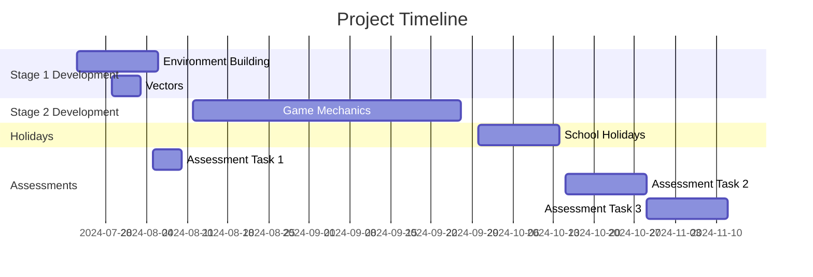

This is a *rough* plan for the semester's project.

```mermaid
gantt 
	title Project Timeline 
	dateFormat YYYY-MM-DD 
	section Stage 1 Development 
		Environment Building :env1, 2024-07-23, 14d 
		Vectors: theory1, 2024-07-29, 5d
	section Stage 2 Development 
		Game Mechanics :2024-08-12, 2024-09-27 
	section Holidays
		School Holidays :2024-09-30, 2024-10-14 
	section Assessments
		Assessment Task 1 :assmt1, 2024-08-05,5d
		Assessment Task 2 :assmt2, 2024-10-15,14d
		Assessment Task 3 :after assmt2, 14d
```