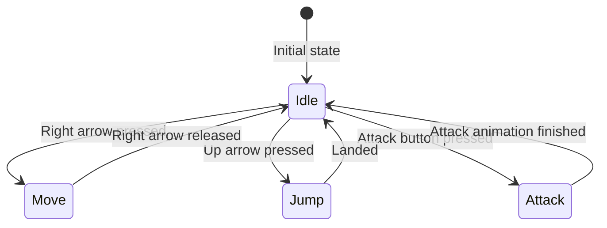

# Video Explanations

<iframe width="560" height="315" src="https://www.youtube.com/embed/ow_Lum-Agbs?si=5BigIyS3tOoi13j5" title="YouTube video player" frameborder="0" allow="accelerometer; autoplay; clipboard-write; encrypted-media; gyroscope; picture-in-picture; web-share" referrerpolicy="strict-origin-when-cross-origin" allowfullscreen></iframe>


<iframe width="560" height="315" src="https://www.youtube.com/embed/-1Gz46Ihk5A?si=2vo2ZWYNRzztYapU" title="YouTube video player" frameborder="0" allow="accelerometer; autoplay; clipboard-write; encrypted-media; gyroscope; picture-in-picture; web-share" referrerpolicy="strict-origin-when-cross-origin" allowfullscreen></iframe>


# Technical Explanation

> [!info] Google Gemini

**Understanding the State Design Pattern**

The State Design Pattern is a behavioural design pattern that allows an object to alter its behaviour when its internal state changes. Think of a character in a game: they can be idle, running, jumping, or attacking. Each of these is a different state, and the character's behaviour changes accordingly.

**Implementing State Design Pattern in Godot**

Godot provides a flexible environment for implementing the State Design Pattern. We can use scripts, nodes, or a combination of both to represent different states.

### Basic Implementation: Using Scripts

1. **Define States:**
	1. Create separate scripts for each state (e.g., IdleState, RunState, JumpState).
	2. Each state script should have methods for entering, exiting, and updating the state.
2. **Create a State Machine:**
	1. Create a script for the object that will have different states (e.g., Player).
	2. This script should have a variable to store the current state.
	3. It should also have methods to transition between states.
3. **Manage State Transitions:**
	1. In the update method of the object, call the update method of the current state.
	2. Check for conditions to trigger state transitions and change the current state accordingly.

```gdscript
extends CharacterBody3D

export var move_speed = 200
export var jump_force = -300

var state: State

func _ready():
    state = IdleState.new(self)

func _physics_process(delta):
    state.update(delta)

func change_state(new_state: State):
    if state:
        state.exit()
    state = new_state
    state.enter()
```


```gdscript
class IdleState:
    extends Object

    var owner: CharacterBody3D

    func _init(owner: CharacterBody3D):
        self.owner = owner

    func update(delta):
        if Input.is_action_just_pressed("ui_right"):
            owner.change_state(RunState.new(owner))
        elif Input.is_action_just_pressed("ui_up"):
            owner.change_state(JumpState.new(owner))

    func exit():
        pass
```

```gdscript
class RunState:
    extends Object
    # ... similar structure as IdleState

class JumpState:
    extends Object
    # ... similar structure as IdleState
```
### Advanced Implementation: Using Nodes

1. **Create State Nodes:**
    
    - Create separate scenes for each state (e.g., IdleState.tscn, RunState.tscn).
    - Each state node should have logic for entering, exiting, and updating the state.
2. **Create a State Machine Node:**
    
    - Create a scene for the state machine (e.g., StateMachine.tscn).
    - This node should have a child node for the current state.
    - It should have methods to add, remove, and switch states.
3. **Manage State Transitions:**
    
    - The state machine node handles transitions between states by adding or removing child nodes.

```gdscript
# StateMachine.gd
extends Node

var current_state: State

func add_child(child: Node) -> void:
    .add_child(child)
    if child is State:
        current_state = child

func remove_child(child: Node) -> void:
    .remove_child(child)
    if child == current_state:
        current_state = null
```


**Advantages of Using State Design Pattern**

- Improved code organization and readability.
- Easier to add or modify states without affecting other parts of the code.
- Enhanced code reusability.
- Better handling of complex behaviors.

**Additional Considerations**

- **Hierarchical State Machines:** For more complex behaviors, consider using hierarchical state machines.
- **State Transitions:** Clearly define the conditions for state transitions.
- **Data Sharing:** Ensure proper data sharing between states.
- **Performance:** Optimize state transitions and updates for performance.

By effectively using the State Design Pattern, you can create more flexible, maintainable, and scalable game code in Godot.

# High Level Overview
This shows the high level view of the transitions between states for an example player movement state machine.
\
