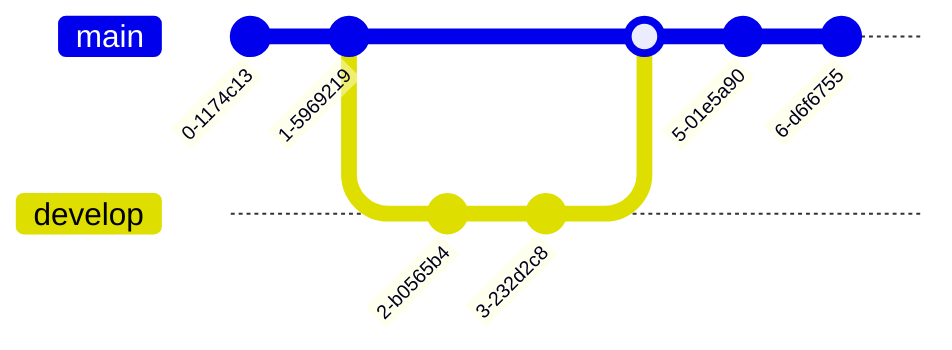

  
# Welcome to Semester 2

- Continuing Flask development.
- Developing `A New Homepage`, further exploring Flask, databases etc

note: 
Building from last semester. 
The basic website structure from last semester will be brought across (user management, base template, navbar etc), to focus more on further development. 
Many will be smaller modules of functionality, like a shopping list, resume builder etc.

---
# Slides

- This file (and other 'presentation' files) can be opened as Slides in Obsidian.

![[openSlidesView.png]]

---
# Preparation

- Install [Obsidian](https://obsidian.md/)
- [Holocron](https://github.com/Lake-Tuggeranong-College/Holocron)
	- Fork Holocron (this repository)
	- Clone repository to device
- Open Holocron in Obsidian

---
# Development Environment

- Project can be developed
	- GitHub Codespaces (online)
	- Visual Studio Code & Docker (offline
- Visual Studio Code & Docker can't be run on Chromebook.
	- Instructions on Holocron
- Install SQLite into environment
- Test Environment

note:
Choose which development environment works for you. There is no right or wrong answer.

---
# Mermaid

