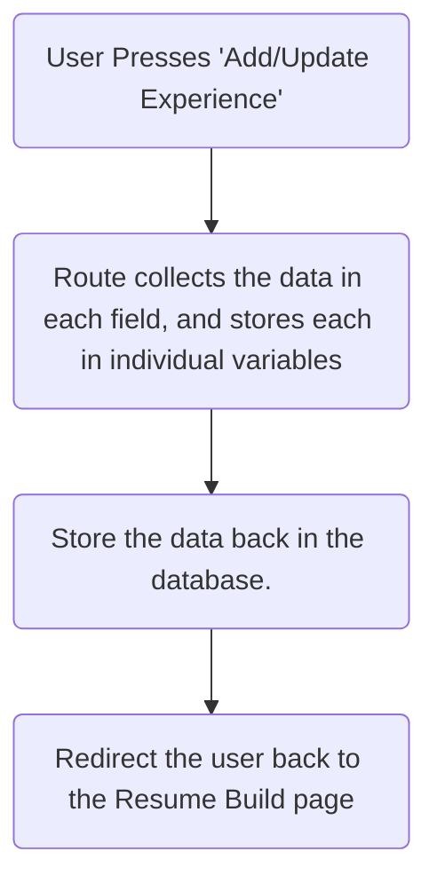

> [!tip]- Goal
> The goal of this tutorial is to develop a standalone web-app for users to build a resume. Users will be able to add Work or Educational Experience to their resume. Users will also be able to edit those entries.
> Users will be able to produce, and print, a resume from the website as well.

# Update the Navigation bar

Before modifying the rest of the code, create the two links that will be used throughout the process. This will help you test your site and confirm functionality.

Open `base.html` in the templates directory. Add the two links below into the section of code for users who are logged in.


```html
<a class="nav-link" href="/resumeBuild">Build Resume</a>
<a class="nav-link" href="/resumeDisplay">Display Resume</a>
```


# Create Resume Entries

> [!tip]- Goal
> This phase will focus on collecting the data from the user.
> This phase is similar to the TODO app in it's approach, although focused on Resume data instead.

## Database

Start by creating the tables required to store all the required data.

To keep things simple, one table will be created that will hold both Work and Education experience. 

The database will contain a small number of fields. 

| Field                   | Description                                                               |
| ----------------------- | ------------------------------------------------------------------------- |
| `id`                    | Primary Key, uniquely identify the record                                 |
| `userID`                | Links to the individual user, through the `user` table.                   |
| `experienceTitle`       | The job title or qualification                                            |
| `experienceTime`        | When the user worked the job, or completed the qualification              |
| `experienceLocation`    | The name of the employer, or the institution they graduated from          |
| `experienceDescription` | Job requirements, or details of the qualification                         |
| `experienceWork`        | Boolean, if `true`, then it was a job. If `false`, then it was education. |
The Entity Relationship Diagram (ERD) would look like this.


Create the table by opening the Database view, and clicking on the `+` to create a new table.


Enter the following SQL and run.

```sql
CREATE TABLE resume_experience(  
    id INTEGER NOT NULL PRIMARY KEY AUTOINCREMENT,
    userID INTEGER NOT NULL,
    experienceTitle TEXT,
    experienceTime TEXT,
    experienceLocation TEXT,
    experienceDescription TEXT,
    experienceWork BOOLEAN
)
```

Your table should be created in the database.


## Model

Open `models.py` and create a new class entry to match the table just created.


```python
class ResumeExperience(db.Model):
    id = db.Column(db.Integer, primary_key=True, autoincrement=True)
    userID = db.Column(db.Integer)
    experienceTitle = db.Column(db.String(255))
    experienceTime = db.Column(db.String(255))
    experienceLocation = db.Column(db.String(255))
    experienceDescription = db.Column(db.String(255))
    experienceWork = db.Column(db.Boolean)
```

Open `app.py` and add the new class to the import statement.


Save the file.

## Forms

The form that will be defined here will be used to
- Create new resume entries, and
- Edit existing entries.

```python
class ResumeForm(FlaskForm):
    experienceTitle = StringField("Experience Title", validators=[DataRequired()])
    experienceTime = StringField("Experience Time", validators=[DataRequired()])
    experienceLocation = StringField("Experience Location", validators=[DataRequired()])
    experienceDescription = StringField("Experience Description", validators=[DataRequired()])
    submit = SubmitField("Add/Update Experience")
```
Save the file.

Open `app.py` and import the newly created form.


Save the file.

## Logic - `app.py`

Create a new route to build the resume.

> [!tip] This code will generate errors at this stage, as the variables haven't been defined yet.


```python
@app.route("/resumeBuild", methods=["POST", "GET"])
def resumeBuild():
    return render_template("resumeBuild.html", title="Resume", user=current_user, form=form, resume_data=resume_details)
```

To prepare for displaying the page, you will need to first load the `ResumeForm` form.


```python
form=ResumeForm()
```

And then load any resume entries made by the user (if any).


```python
resume_details = ResumeExperience.query.filter_by(userID=current_user.id).all()
```

The HTML page will not only display the current resume entries, but it will also contain a form for the user to add new entries for their resume. The page will update after the form has been submitted with the new data.

In order for this to occur, the code needs to test for when the user submits the form - this is done through a `POST` request. This `if` statement will be executed when the user presses submit. 


For each form field, the code will get the form data and store it in a variable. Then it will create a new database record, and commit that record back to the database.

Note the code highlighted with the green square is one line of code. This line is repsonsible for collecting all the form data and storing each piece of data into the variables defined in the `ResumeExperience` model.

> [!important] The line of code `experienceWork=False if request.form.get('experienceWork') == None else True` is a little complex. This focuses on the value of a check box in the form. If the checkbox is ticked, then it stores `True` into the database, indicating the entry is a Work Experience entry. If the checkbox is not ticked (i.e. the `experienceWork == None`, then it will write `False` into the database.)


```python
if request.method == "POST":
        new_resume = ResumeExperience(userID=current_user.id, experienceTitle=request.form['experienceTitle'], experienceTime=request.form['experienceTime'], experienceLocation=request.form['experienceLocation'], experienceDescription=request.form['experienceDescription'], experienceWork=False if request.form.get('experienceWork') == None else True)
        db.session.add(new_resume)
        db.session.commit()
```

The final route code should appear as:


## Interface - HTML

The last step in this stage of the development is to build the HTML template to:
1. Display the current resume entries for the user.
2. Display a form to collect data for a new resume entry.

In the `templates` folder, create a new file called `resumeBuild.html`.


Replace any default code with the following. This includes some CSS to help display the resume entries - each alternating line in the *table* will have a different background colour. This is done to make it easier to distinguish between each line. 

```html



<style type="text/css">
    .resume-row:nth-of-type(odd) {
        background-color: #EBF5EE;
    }

    .resume-row:nth-of-type(even) {
        background-color: #c1cac3;
    }
</style>



<h1>Resume Builder</h1>

<h2>Add new Entries</h2>









<div class="footerText">Copyright 2024.</div>

```

Edit the `rowTwoColTwoContents` section to create a table structure, using Bootstraps `container-fluid` class.


```html
<div class="container-fluid">
    <div class="row">
        <div class="col-md-3 h5">Job Title or Qualification</div>
        <div class="col-md-2 h5">Time Period</div>
        <div class="col-md-2 h5">Employer or Qualification Issuer</div>
        <div class="col-md-3 h5">Details</div>
        <div class="col-md-1 h5">Work Experience?</div>
    </div>
</div>
```

Now to add the code to display the entries. The individual entries were compiled in the `app.py` route, and put into an array. That array was passed through to the template using the `resume_data` variable. 


The array can be looped through each record to display each field within the entry. 

For each entry in the array, a new row is created. And each row displays each piece of data within the entry in a new cell.

Instead of outputting a `True` or `False` for the Work field, a check is done. If it is `True`, then "Work" is outputted, otherwise, it's "Education".

> [!important] Note where the new code is added. It should be within the `container-fluid` with one `</div>` after it.

>[!tip] You may notice that the `experienceTitle` has been defined as a link. This is done to link to the edit page, which will be created later.


```python

    <div class="row resume-row">
        <div class="col-md-3"> <a href='/resume_edit/{{resume.id}}'>{{ resume.experienceTitle }}</a> </div>
        <div class="col-md-2"> {{ resume.experienceTime }}</div>
        <div class="col-md-2"> {{ resume.experienceLocation }}</div>
        <div class="col-md-3"> {{ resume.experienceDescription }}</div>
        <div class="col-md-1">
            
            Work
            
            Education
            
        </div>
    </div>
    
```

Save the file.
## Test the site

At this stage, the site should be able to display a page (with nothing on it). It will show the structure of the page.


## Add the form

**After** the `` line, add the following code. This displays the form for the user to add a new entry in the database.


```html
<div class="container-fluid">
        <div class="row">
            <h3>New Entry</h3>
        </div>
        <div class="row">
            <form method="POST" action="/resumeBuild">
                <div class="mb-3">
                    <label for="title" class="form-label">Title</label>
                    <input type="text" class="form-control" id="experienceTitle" name="experienceTitle" placeholder="Enter Job/Education Title. e.g. CEO/Bachelor of Arts">
                </div>
                <div class="mb-3">
                    <label for="description" class="form-label">Location</label>
                    <input type="text" class="form-control" name="experienceLocation" rows="1" placeholder="Enter company name or qualification issuer">
                </div>
                <div class="mb-3">
                    <label for="description" class="form-label">Description</label>
                    <textarea class="form-control" id="experienceDescription" name="experienceDescription" rows="3" placeholder="Enter description of experience. e.g Job responsibilities or subjects studied"></textarea>
                </div>
        
                <div class="mb-3">
                    <label for="time" class="form-label">Time</label>
                    <input type="text" class="form-control" id="experienceTime" name="experienceTime" placeholder="Enter the years holding the position, or completion of qualification.">
                </div>
                <div class="form-check">
                    <input class="form-check-input" type="checkbox" id="experienceWork" name="experienceWork" >
                    <label class="form-check-label" for="checkbox" >Check if Work experience, leave blank for education.</label>
                </div>
                <p>{{ form.submit() }}</p>
            </form>
        </div>
```


Save the file.
## Test the site (again)

The Resume Build page should load again, however now with a form.


Create a new Entry, and press `Add/Update Experience`. The new field should appear on the page. 

Test creating new entries, for both Work and Education.


![[commonBlocks#Commit & Push]]
# Edit Resume Entries

> [!tip]- Goal.
> The Resume Build page lists the current entries in the user's resume, and the title has been created as a link that opens the edit page. This is the focus of this section of the tutorial.

The link will be dynamically generated using the `id` of the resume's entry, so a link will be structured like:

`http://127.0.0.1:5001/resume_edit/<resume entry id>`

for example:

`http://127.0.0.1:5001/resume_edit/31`

The goal is to have a form load with the current details, the user can edit the details and submit to update the database. The page will look like


## Interface - HTML

Create a new file in the `templates` directory called `resumeEdit.html`.


The template code for this page will be very similar to the code to create new entries on `resumeBuild.html`. 

The main differences are:
- The page doesn't list the existing entries, and more importantly,
- Uses the current values for the resume entry and pre-populates the fields for the user.

Pre-populating the fields is done through the `value` attribute. For example:  `value="{{resume_data.experienceTitle}}"` 

```html



<style type="text/css">
    .resume-row:nth-of-type(odd) {
        background-color: #EBF5EE;
    }

    .resume-row:nth-of-type(even) {
        background-color: #c1cac3;
    }
</style>



<h1>Resume Builder</h1>

<h2>Add new Entries</h2>








<div class="container-fluid">
    <div class="row">
        <h3>{{title}}</h3>
    </div>
    <div class="row">
        <form method="POST" >
            <div class="mb-3">
                <label for="title" class="form-label">{{ form.experienceTitle.label }}</label>
                <input type="text" class="form-control" id="experienceTitle" name="experienceTitle" value="{{resume_data.experienceTitle}}">
                
                <span style="color: red;">[{{ error }}]</span>
                
            </div>
            <div class="mb-3">
                <label for="description" class="form-label">{{ form.experienceLocation.label }}</label>
                <input type="text" class="form-control" id="experienceLocation" name="experienceLocation" rows="1" value="{{resume_data.experienceLocation}}">
            </div>
            <div class="mb-3">
                <label for="description" class="form-label">{{ form.experienceDescription.label }} </label>
                <textarea class="form-control" id="experienceDescription" name="experienceDescription" rows="3">{{resume_data.experienceDescription}}</textarea>
            </div>
            <div class="mb-3">
                <label for="time" class="form-label">{{ form.experienceTime.label }}</label>
                <input type="text" class="form-control" id="experienceTime" name="experienceTime" value="{{resume_data.experienceTime}}">
            </div>
            <div class="form-check">
                <input class="form-check-input" type="checkbox" id="experienceWork" name="experienceWork" value="{{resume_data.experienceWork}}">
                <label class="form-check-label" for="checkbox" >Check if Work experience, leave blank for education.</label>
            </div>
            <p>{{ form.submit() }}</p>
        </form>
    </div>
</div>





<div class="footerText">Copyright 2024.</div>

```

Save the file.

## Logic - `app.py`

Create the route for editing the resume entries. This code creates the route, and loads the Resume form, as done with the Resume Build route. 

Additionally, it loads the details of the resume entry identified by the `<resume_id>` in the URL. These details are sent to the template through the `resume_data` variable so the form can pre-populate the data.


```python
@app.route("/resume_edit/<resume_id>", methods=["POST", "GET"])
def edit_resume_entry(resume_id):
    form = ResumeForm()
    resume_entry = ResumeExperience.query.filter_by(id=resume_id).first()
    
    return render_template("resumeEdit.html", title="Resume - Edit Entry", user=current_user, form=form, resume_data=resume_entry)

```

The last main step to allow editing of the data is:




Update the code to perform these steps.


```python
if request.method == "POST":
        db.session.query(ResumeExperience).filter_by(id=resume_id).update({
            "experienceTitle": request.form['experienceTitle'],
            "experienceTime": request.form['experienceTime'],
            "experienceLocation": request.form['experienceLocation'],
            "experienceDescription": request.form['experienceDescription'],
            "experienceWork": False if request.form.get('experienceWork') == None else True
        })
        db.session.commit()
        return redirect("/resumeBuild")
```

Save the file.

## Test Editing a record

Run the site and edit a record! Test all the fields and confirm that each field gets updated.


# Resume Display

> [!tip]- Goal
> This phase will focus on displaying the resume in an aesthetic format.

The final step in the resume-building process is creating a dedicated page on your website that showcases your resume in a visually appealing and printer-friendly format. Consider visual design, print optimisation, and responsiveness to ensure your resume is presented effectively on screen and in print. Embed your resume using a PDF viewer or image, include navigation features for easy access, and provide options for downloading and printing the resume. By creating a professional display page, you can enhance the presentation of your resume and make it easily accessible to potential employers and recruiters.


## Interface - HTML

Create a new template in the `templates` directory. Name the file `resumeDisplay.html`.


Add the default code to the file.

```html






<h1>Resume</h1>









<div class="footerText">Copyright 2024.</div>

```

At this stage, the page will only contain two sections, one for the Work experience, and another for the Education experience. These will be collated and organised through the route (created later), allowing the template to focus on displaying the data.

Each section will involve looping over the data and displaying each field. In the first stage, the data will just be 'dumped' on the page. Later, the interface will be improved.


```jinja2
<h2>Work Experience</h2>


<p>
    {{workEntry.experienceTitle}}
    {{workEntry.experienceTime}}
    {{workEntry.experienceLocation}}
    {{workEntry.experienceDescription}}
</p>


<h2>Education</h2>


<p>
    {{educationEntry.experienceTitle}}
    {{educationEntry.experienceTime}}
    {{educationEntry.experienceLocation}}
    {{educationEntry.experienceDescription}}
</p>

```

Save the file.
## Logic - `app.py

The route for this is relatively simple. The route loads the user's resume details, first only the work experience, and then the education experience. The two variables are then sent separately to the template.


```python
@app.route("/resumeDisplay")
def resumeDisplay():
    userExperienceWork = ResumeExperience.query.filter_by(
        userID=current_user.id, experienceWork=1).all()
    userExperienceEducation = ResumeExperience.query.filter_by(
        userID=current_user.id, experienceWork=0).all()
    return render_template("resumeDisplay.html", title="Resume", user=current_user, userExperienceWork=userExperienceWork, userExperienceEducation=userExperienceEducation)

```

Save the file.

## Test the page

Run the site and access the page to display your resume. The page will be rendered similar to this.


# Resume Display Improvement

Your challenge is to improve the interface for the resume display page. Currently, the data is just outputted on the page in the different sections. 

Use the official [bootstrap documentation](https://getbootstrap.com/docs/5.3/getting-started/introduction/) to assist you. Or you can search for other tutorials on how to display information in different ways.

One such method would be to use bootstrap's [cards](https://getbootstrap.com/docs/5.3/components/card/) to display each entry. This could be rendered like this:


