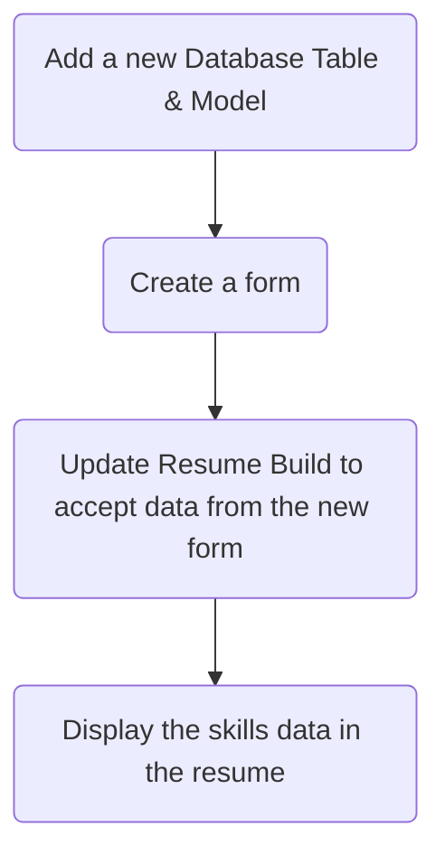

> [!important]- Goal
> Add a few more features to the resume, namely:
> - Referees
> - Skills rating
> 
> And finally, allow the resume to be printed in a user friendly format.


# Referees

> [!tip] This was the extension goal for a previous week. If you have completed this already, then skip this section.

## Database & Model Changes

Create the table in the database, following the process from previous modifications:

```sql
CREATE TABLE resume_referees(  
    id INTEGER NOT NULL PRIMARY KEY AUTOINCREMENT,
    name TEXT NOT NULL,
    contact_number TEXT NOT NULL,
    email_address TEXT NOT NULL,
    userID INTEGER NOT NULL
);
```

Update `models.py` to create a new class to match the new table:


```python
class ResumeReferees(db.Model):
    id = db.Column(db.Integer, primary_key=True, autoincrement=True)
    name = db.Column(db.String(255))
    contact_number = db.Column(db.String(255))
    email_address = db.Column(db.String(255))
    userID = db.Column(db.Integer)
```

## `forms.py`

Open `forms.py`. Due to changes required further in the code, you will need to:
- Change the variable for the SubmitField for `ResumeForm` to `submit1`, and 
- Create the new RefereeForm class. Notice that the SubmitField is named `submit2`.


```python
class RefereeForm(FlaskForm):
    refereeName = StringField("Referee's Name", validators=[DataRequired()])
    refereeContactNumber = StringField("Referee's Contact Number", validators=[DataRequired()])
    refereeEmailAddress = StringField("Referee's Email Address", validators=[DataRequired()])
    submit2 = SubmitField("Add Referee")
```


## `app.py`

### Imports

First, add the newly created classes to the import statements near the top of the file.


### `resumeBuild()`

Several changes need to be made to this function for the new referee functionality to be included. The first step is renaming `form` to `formResume` to distinguish it from the other form (to be added).

Right-click on `form` and choose **Rename Symbol**. Change the name to `formResume` and hit enter. 


Create a new variable for `RefereeForm`.


```python
formReferee = RefereeForm()
```

Update the remainder of the function to check which form was submitted (using which button) and update the relevant database. The `renderTemplate()` function call will also need to be updated to send both forms to the `resumeBuild.html` template.


```python
if formResume.submit1.data and formResume.validate:
	new_resume = ResumeExperience(
		userID=current_user.id, 
		experienceTitle=request.form['experienceTitle'], 
		experienceTime=request.form['experienceTime'], 
		experienceLocation=request.form['experienceLocation'], 
		experienceDescription=request.form['experienceDescription'], 
		experienceWork=False if request.form.get('experienceWork') == None else True)
	db.session.add(new_resume)
	db.session.commit()

if formReferee.submit2.data and formReferee:
	new_referee = ResumeReferees(
		userID=current_user.id, 
		name=request.form['refereeName'], 
		contact_number=request.form['refereeContactNumber'], 
		email_address=request.form['refereeEmailAddress'])
	db.session.add(new_referee)
	db.session.commit()

return redirect(url_for("resumeBuild"))
```


### `resumeDisplay()`
Update `resumeDisplay()` to load the referees for the user. This process is done in the same manner as loading the experience from the database, just from the new table.

You'll then need to add the referee data to send to the template.


```python
userReferees = ResumeReferees.query.filter_by(userID=current_user.id).all()
```

## `resumeBuild.html`

Open `resumeBuild.html` and update to reflect the changes made, to accomodate adding Experience and Referees.


Add the code for the Referee form.

> [!important] Pay attention to the `</div>` tags to ensure the page will be laid out correctly.


```html
<div class="row">
	<h3>New Referee</h3>
</div>
<div class="row">
	<form method="POST" action="/resumeBuild">
		<div class="mb-3">
			<label for="title" class="form-label">Referee Name</label>
			<input type="text" class="form-control" id="refereeName" name="refereeName" placeholder="Enter Name">
		</div>
		<div class="mb-3">
			<label for="description" class="form-label">Referee Contact Number</label>
			<input type="text" class="form-control" id="refereeContactNumber" name="refereeContactNumber"
				placeholder="Enter Contact Number">
		</div>
		<div class="mb-3">
			<label for="description" class="form-label">Referee Email Address</label>
			<input type="text" class="form-control" id="refereeEmailAddress" name="refereeEmailAddress"
				placeholder="Enter Email Address">
		</div>
		<p>{{ formReferee.submit2() }}</p>
</div>
```

## `resumeDisplay.html`

The final step is to code the resume to display the referees. Open `resumeDisplay.html`.

Add the code to iterate over any referees the user has and display them.


```html
<h2>Referees</h2>

<div class="container-fluid">
  


  <div class="row">
    <div class="col-sm-4">
      <h6>{{referee.name}}</h6>
    </div>
    <div class="col-sm-4">{{referee.email_address}}</div>
    <div class="col-sm-4">{{referee.contact_number}}</div>
  </div>
  

</div>
```

> [!tip] Currently, the referees are displayed in a standard bootstrap grid. Your challenge is to display the information better, such as how the experience information was displayed.


![[commonBlocks#Commit & Push]]


# Skills
> [!tip] Some resumes include a skills section for people to rate their knowledge on certain topics.

The approach for this section will be largely similar to adding in Referees into the process. You will need to:



## Database & Model

Create a table with the following structure:

| Field  | Data Type                            | Purpose                       |
| ------ | ------------------------------------ | ----------------------------- |
| id     | INTEGER, auto increment, primary key | Unique identifier             |
| skill  | TEXT                                 | Identified Skill              |
| rating | INT                                  | Users's self-evaluation (1-5) |
| userID | INT                                  | User's ID to link to.         |

```sql
CREATE TABLE resume_skills(  
    id INTEGER NOT NULL PRIMARY KEY AUTOINCREMENT,
    skill TEXT NOT NULL,
    rating INTEGER NOT NULL,
    userID INTEGER NOT NULL
);
```

The model for this new table is:

```python
class ResumeSkills(db.Model):
    id = db.Column(db.Integer, primary_key=True, autoincrement=True)
    skill = db.Column(db.String(255))
    rating = db.Column(db.Integer)
    userID = db.Column(db.Integer)
```

## Form

The form code is shown here. Note the variable `submit3` to distinguish it from the other forms.

```python
class SkillForm(FlaskForm):
    skill = StringField("Skill", validators=[DataRequired()])
    rating = IntegerField("Rating", validators=[DataRequired()])
    submit3 = SubmitField("Add Skill")
```

## `app.py`

Update both the `resumeBuild()` and `resumeDisplay()` functions to load the appropriate data from the database, and send the data to the template. The process will be extremely similar to the changes required for the referees - so follow the steps (modifying the code as appropriate) for that section.

## Challenge!

Instead of the user entering the rating as a number out of 5, update the form to show a drop-down list of the values.

> [!hint] A drop-down list is called a **Select** in HTML. You may find [this page](https://getbootstrap.com/docs/5.3/forms/select/) useful.


## Another Challenge!

Instead of displaying the rating as just a number or text, change `resumeDisplay.html` to display a star (or other symbol) to represent the rating.


To do this you could first check the value then display a star. Do this in the template, you could use code similar to this:

```jinja2

⭐️


```

# Printing Webpages

Currently, when attempting to print, the resume format is distorted.


Research into how to use CSS to print webpages in a print-friendly format.

## Resources

You can start with these sites:

https://www.tutorialspoint.com/css/css_printing.htm

https://www.geeksforgeeks.org/bootstrap-5-display-in-print/

https://getbootstrap.com/docs/5.3/utilities/display/#display-in-print

# Submit

In this week's Google Classroom, submit the resume as a PDF from the printing process. 
