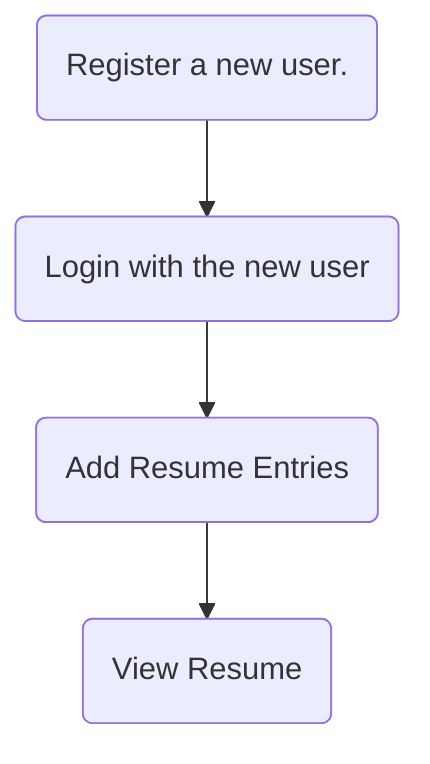

> [!Important]- Goal
> The goal for this stage of the development is to improve the Resume User Interface and Experience. You will improve the website's rendering in the browser, and for printing. You will also make changes across the project to add User Profile Pictures & contact numbers to add to the resume.
> You'll also add a section for Referees.


# User Updates
> In this section, you'll add:
> - User Profile Pictures
> - Phone number

## Database changes

To support the changes to the resume, new fields need to be added to the `User` table. 
Open the database view and expand the `User` table.


Hover the mouse over the Columns row, and some buttons will appear on the right. The one of interest is the `Add Column` button. Press that button.


SQLite doesn't allow the creation of multiple columns in a single command, so each column has to be created separately. Enter the SQL to create two new columns:

| Column         | Data Type | Purpose                                                                                             |
| -------------- | --------- | --------------------------------------------------------------------------------------------------- |
| photo          | TEXT      | Store the link to the user's profile picture                                                        |
| contact_number | TEXT      | Store the user's contact number as text. If stored as an integer, the leading `0` would be dropped. |


```sql
ALTER TABLE "User" 
    ADD COLUMN photo TEXT;

ALTER TABLE "User" 
    ADD COLUMN contact_number TEXT;
```

> [!important]- Why a TEXT field for the photo?
> There are two approaches you could take for the storage of the users photos. Either:
> 1. Store the image as a binary in the database, or
> 2. Store the image on a file server, and store the link to that image in the database.
>    
> Both approaches have pros and cons.
> In this project, the image file will be stored in the file system, and the filename will be stored in the database. This approach stops the database from increasing in size very quickly. 

Press the `Run` link on each of the SQL statements. Afterwards, the table will be modified with the new columns. 

> [!tip] You should press the Refresh button to show the new columns. ]


## User Model
As the database structure has changed, the relevant model/s will need to change to match the updates. In this case, the user model needs to include the new fields.

Open `models.py` and update the `User` class.


```python
photo = db.Column(db.String(255))
contact_number = db.Column(db.String(255))
```

## Registration
As the user now has a photo and contact number, the registration process must be updated to include these.

### `forms.py`

Open `forms.py` and update the `RegistrationForm` class to ask the user for the new data. Note that the photo field is a `FileField` meaning the user will be shown a button to select a file.


```python
photo = FileField('Photo File Upload', validators=[FileRequired()])
contact_number = StringField("Contact Number", validators=[DataRequired()])
```

Save the file.

### `bp_user_management.py`

> [!tip] You will get some errors when developing this stage. They will be resolved later in the tutorial. This is because fundamental changes are being made across the entire project.
> 

The registration process is the same as before, except for the complexity surrounding the upload of images. This introduces several potential issues, namely ensuring that the user uploads valid image files and the naming of the file. 

If two users register with images named the same, e.g. `photo.jpg`, this would cause issues if the system didn't anticipate the issue. Without additional development, users could find their profile pictures overridden by other users, which would be less than ideal.

The approach taken for this project is to rename the file to a unique name when the image is being uploaded. Instead of saving the file as `photo.jpg`, it could be stored as `893c109f-faa1-4fbd-b082-69a45e57dd57.jpg`. Luckily, there are some functions to generate these unique identifiers (called UUIDs).

Update the import statements at the top of the file to import the `secure_filename` functionality.


```python
from werkzeug.utils import secure_filename
import os
```

Additionally, update the `from app import db` line of code to include `ALLOWED_EXTENSIONS, UPLOAD_FOLDER`


Create a new function to determine if the file type the user selects is valid or not.


```python
# Confirm filetype is allowed
def allowed_file(filename):
    return '.' in filename and \
           filename.rsplit('.', 1)[1].lower() in ALLOWED_EXTENSIONS
```


Update the `register()` function to upload an image, store it, and create the user object with all of the data required.

> [!important] There are several highlighted changes in this code to note.
> RED: new lines of code
> GREEN: modified lines of code
> PURPLE: lines of code has been indented.
> 


```python
 new_image = form.photo.data
        filename = secure_filename(new_image.filename)
        if new_image and allowed_file(filename):
            file_ext = filename.split(".")[1]
            import uuid
            random_filename = str(uuid.uuid4())
            filename = random_filename + "." + file_ext
            new_image.save(os.path.join(UPLOAD_FOLDER, filename))

            # create a new user in memory
            new_user = User(email_address=form.email_address.data, name=form.name.data, user_level=1, active=True, photo=filename, contact_number=form.contact_number.data) 
            
```

Save the file.

### Registration Template

Open `register.html`. This page needs to be updated to allow for the collection of the contact number and the uploading of the users photo.

The first change to make is to configure the form to allow for the uploading of images. As there is text data to upload and binary data, the form needs to be configured to accept all data types.


Add the fields for the new data.


```html
  <p>
	{{ form.contact_number.label }}<br>
	{{ form.contact_number(size=64) }}<br>
	
	<span style="color: red;">[{{ error }}]</span>
	
</p>
<p>
	{{ form.photo.label }}<br>
	{{ form.photo(size=64) }}<br>
	
		<span style="color: red;">[{{ error }}]</span>
	
</p>
```

## Resume Display Updates

The final piece of the puzzle is displaying data. The foundations are already there, only slight modifications are needed. 
As the changes are only required from the `User` model and database, the route **does not** need to be modified - the `current_user` variable contains all the updates that have been implemented.

Open the `resumeDisplay.html` template.

Add the user's name in the title.


Update the `rowTwoColOneContent` with the users image and contact details.


```html
<div class="container-fluid">
	<div class="row">
	  <div class="col-sm-12"></div>
	</div>
	<div class="row">
	  <div class="col-sm-12"><h6>Contact Details</h6></div>
	</div>
	<div class="row">
	  <div class="col-sm-12 small">{{user.email_address}}</div>
	</div>
	<div class="row">
	  <div class="col-sm-12 small">{{user.contact_number}}</div>
	</div>
</div>
```

Save the file.


![[commonBlocks#Commit & Push]]

## `userPhotos` directory

Create a new directory in the `/static/images` folder called `userPhotos`.


> [!important] Do not create the folder under the `/images/` folder, but the `/static/images` folder.


## `app.py` Controller Updates

`app.py` will require several changes to process the storage of images. To simplify and centralise the process, a single folder will be defined for the storage of user images, as well as the acceptable file extensions for images.


```python
# Image Upload Configuration
UPLOAD_FOLDER = './static/images/userPhotos/'
ALLOWED_EXTENSIONS = {'png', 'jpg', 'jpeg', 'gif'}
app.config['UPLOAD_FOLDER'] = UPLOAD_FOLDER
```


## Test the changes

Run the site. Test all the changes made:




# Extension Activity - Referees

> In this section, your challenge is to add Referees to the resume.

Consider how the project will need to be modified to add referees to the resume.

Questions:
1. What data needs to be stored about each referee? Name, contact number, email address?
2. Can an existing table be used, or is a new one required?
3. Which parts of the Model, the View and the Controller need to be modified?


## One approach

Create a new table to store data for each referee.

### Database

| Field          | Data Type                            | Purpose                 |
| -------------- | ------------------------------------ | ----------------------- |
| id             | INTEGER, auto increment, primary key | Unique identifier       |
| name           | TEXT                                 | Referee's name          |
| contact_number | TEXT                                 | Referee's phone number  |
| email_address  | TEXT                                 | Referee's email address |
| userID         | INT                                  | User's ID to link to.   |
### Model

A model will need to be created to match the database in `models.py`

```python

class referee (db.Model):
...

```


### Form

Create a new form to create a Referee.

Include this form in `resumeBuild.html`


### `resumeDisplay.html`

Update the page to display the referee details for that user.
