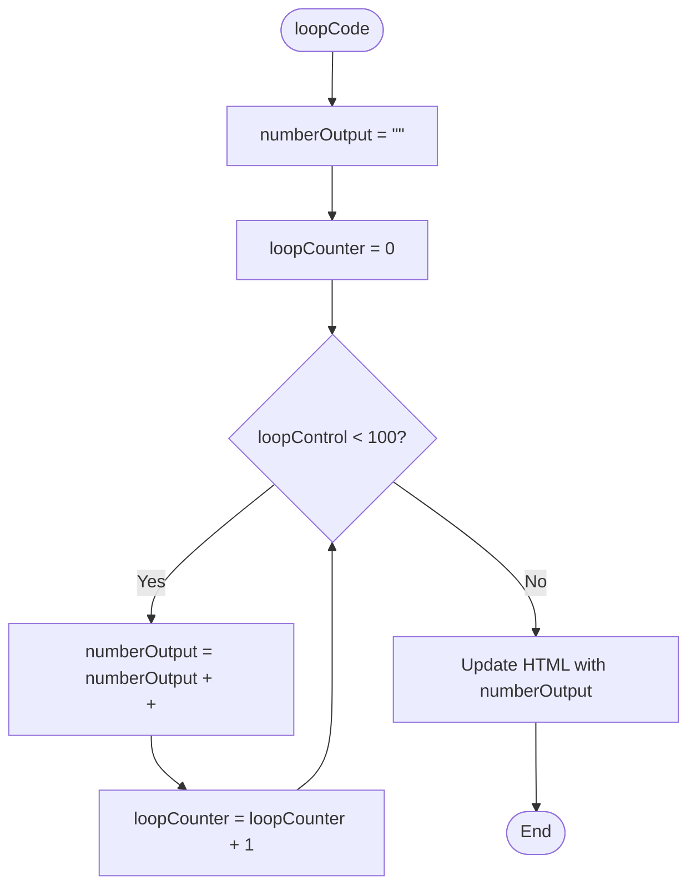
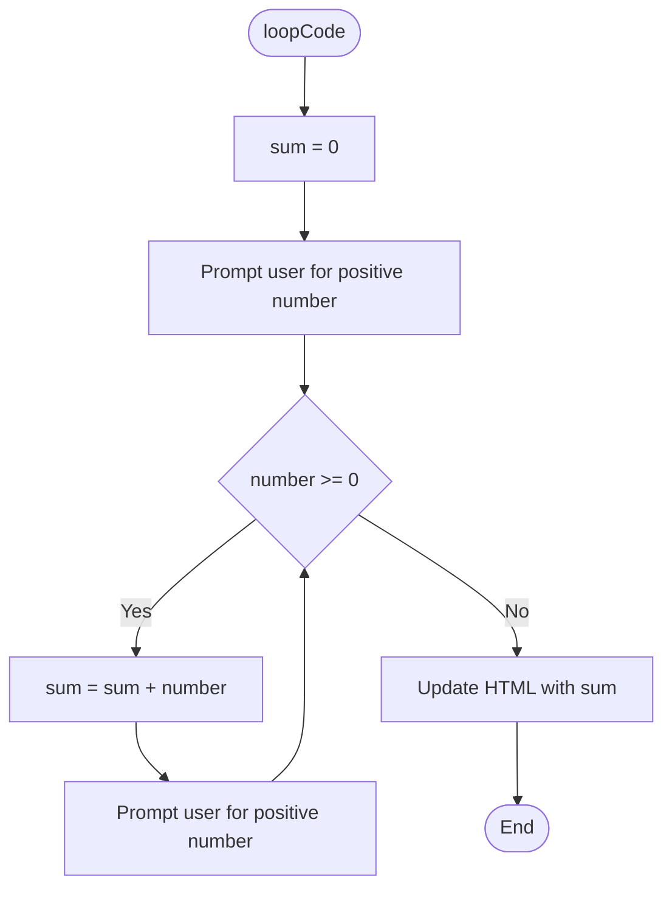
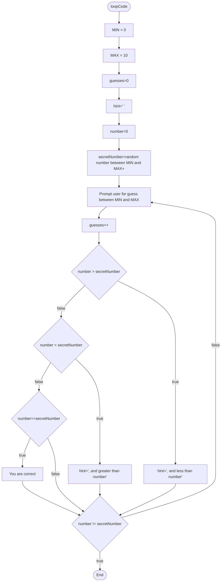

Specific Implementation

The Javascript language has the three loop structures identified on the General Learning Resource - `while`, `do..while` and `for`. As Arduino is a C-based language, the syntax for these are the same as with C, C++ etc.

Here you can see the syntax and an example of each.

## While Loop

```jsx
while (condition) {
    // statement(s)
}
```

### Example

```jsx
var = 0;
while (var < 200) {
    // do something repetitive 200 times
    var++;
}
```

## Do... While Loop

```jsx
do {
    // statement block
} while (condition);
```

### Example

```jsx
int x = 0;
do {
    delay(50);          // slight delay
    x = x + 1;          // add 1 to x.
} while (x < 100);
```

## For Loop

```jsx
for (initialization; condition; increment) {
    // statement(s);
}
```

### Example

```jsx
for (let i = 0; i <= 100; i++)
    {
    document.getElementById("simpleOutput").innerHTML = document.getElementById("simpleOutput").innerHTML+"<br>"+i;
//prints out 0 to 100 in the browserew
    }
```

<aside>
‼️ Remember the *condition* has to equate to either `true` or `false`.

</aside>

# Practical Exercises

## For loop

💁 In this section you’ll practice the **for** loop.

Create a new file called `forLoop.html` in your Software Development Fundamentals project.

💁 The logic of the algorithm is as follows:
When the user presses the “Run Loop” button, output the numbers between 0 and 100 inclusive.




Replace the contents of the file with the code shown here.

This code includes a form, however unlike other pages you may have written, this form has no input and is only used to run a function loopCode() when the user presses the button.

```jsx
<!DOCTYPE html>
<html lang="en">
<head>
    <script>

    </script>
<title>Loop Code</title>
</head>
<body>

<h1>For Loops - Web Development</h1>

<p id="outputPosition"></p>

<form name='loopForm'>
    <button onclick="loopCode()" type="button">Run Loop</button>
</form>

</body>
</html>
```


Inside the <script> </script> tags, create a new function called loopCode(), which takes no arguments.

```jsx
<head>
    <script>
        function loopCode() {
            
        }
    </script>
<title>Loop Code</title>
</head>
<body>
```


Initialise the numberOutput variable.

This variable will be used to store the numbers as one long string to output in the browser.

<aside>
💁 As the loop progresses, this numberOutput variable will contain the string `0<br>1<br>2<br>` etc.

</aside>

```jsx
var numberOutput="";
```


Configure the loop to run the required number of times.

<aside>
💁 When writing loops, you will need to check to make sure it’s running the correct number of times. So check the specifications. In this case the problem is to output the numbers between 0 and 100 inclusive. Will this loop do **exactly** that?

</aside>

```jsx
for (let loopCounter=0; loopCounter<100;loopCounter++) {

}
```


Inside the loop, add the code which will build the string of numbers, with <br> tags in between.

<aside>
💁 When the loop first runs, `numberOutput` is an empty string - “”. The first iteration adds the loopCounter value, which is 0, and adds to the end of `numberOutput`, adding a `<br>` in between. This means that `numberOutput` is `“<br>0”` after the first iteration. 
In the second iteration `numberOutput` becomes `“<br>0<br>1”`
The loop progresses, adding `<br>` and the `loopCounter` value to the end of the string each time.

</aside>

```jsx
numberOutput = numberOutput + "<br>"+ loopCounter;
```


Finally, update the HTML page by replacing the outputPosition tag with the numberOutput string.

```jsx
document.getElementById("outputPosition").innerHTML = numberOutput;
```


Open the HTML file, press the Button and see it outputs the correct data!

If it doesn’t output the required data, what would need to change?


---

## While & Do..While loops

Create a new file - whileLoop.html and replace the contents with the following code.

<aside>
💁 This code is attempting to solve this problem:
Repeatedly ask the user for a positive number. Keep a sum of all numbers entered. Once the user enters a negative number, stop adding and display the sum.

</aside>

```jsx
<!DOCTYPE html>
<html lang="en">
<head>
    <script>
        function loopCode() {
            
        }
    </script>
    <title>Loop Code</title>
</head>
<body>

<h1>For Loops - Web Development</h1>

<p id="outputPosition"></p>

<form name='loopForm'>

    <button onclick="loopCode()" type="button">Run Loop</button>
</form>

</body>
</html>
```

The logic for this code is.

<aside>
💁 You’ll notice that there are two separate boxes for “Prompt user for positive number”. This *may* indicate the code could be slightly more efficient so as to not repeat code.

</aside>



Initialise the sum variable to 0.

```jsx
let sum = 0;
```


Prompt the user for a number and store it in the variable `number`.

<aside>
💁 The command `parseInt` will take the user input and convert it into an integer value so mathematical operations can be performed on it.

</aside>

```jsx
let number = parseInt(prompt('Enter a number: '));
```

Now that the first number has been stored, start the loop. The loop will only run if the number entered is greater than or equal to 0.

```jsx
while (number >= 0) {
                
}
```


Add  `number` onto `sum`.

<aside>
💁 This is shorthand for `sum = sum + number`.

</aside>

```jsx
sum += number;
```


Prompt the user again to enter a number.

```jsx
let number = parseInt(prompt('Enter a number: '));
```


Finally, outside of the loop, update the HTML with the result of the addition.

```jsx
document.getElementById("outputPosition").innerHTML = sum;
```


Open the page in your browser and test the addition!

Is the maths correct?

<aside>
💁 Could this be solved with a do..while loop? If so, what would need to be changed?

- Answer
    
    ```jsx
    let sum = 0;
    let number = 0;
    
    do {
        sum += number;
        number = parseInt(prompt('Enter a number: '));
    } while(number >= 0)
    ```
    
</aside>


---

## Do...while loop

For this example, you are going to write a secret number guesser. 

The logic for this code is shown here.

<aside>
💁 The code will generate a random number between 1 and 10 (inclusive), and the user will need to guess it.

</aside>



Create new file called doWhileLoop.html and replace the contents with this code.

```jsx
<!DOCTYPE html>
<html lang="en">
<head>
    <script>
        function loopCode() {
            
        }
    </script>
    <title>Loop Code</title>
</head>
<body>

<h1>For Loops - Web Development</h1>

<p id="outputPosition"></p>

<form name='loopForm'>

    <button onclick="loopCode()" type="button">Run Loop</button>
</form>

</body>
</html>
```

Initialise the variables needed.

MIN and MAX in this example are **constants**. This means that the code cannot change the values once they’ve been initialised.

```jsx
const MIN = 1;
const MAX = 10;
let guesses = 0; // for storing the number of guesses
let hint = ''; // for storing hint
let number = 0;
```


Generate the secret number. This code can look quite complex, but breaking it down can make it easier to understand. 

`Math.random()` generates a random decimal point value between 0 and 1. E.g. 0.242

That decimal point value is then multiplied by `(MAX - MIN + 1)`, which will be 10-1+1, equalling 10. 

Finally the `MIN` value is added onto that.

Then, the value calculated is run through `Math.floor()` which rounds down the value to a whole number.

In short, in this case it generates a random number between 1 and 10.

```jsx
let secretNumber = Math.floor(Math.random() * (MAX - MIN + 1)) + MIN;
```


Add the `do.. while()` loop structure.

For the moment, don’t put the condition in - this will be added later.

```jsx
do {
                
} while ()
```


Prompt the user for a guess.

This is another complex line of code, with multiple functions.

`parseInt()` has been seen before, and this converts the string entered into an integer value.

`prompt()` similarly has been seen before, and asks the user to enter some form of data in a browser popup.

`${MIN}` is replaced in the string when it’s run with the value of the variable. In this case 0. `${MAX}` is the same, but with 10.

`+ hint` adds the hint string to the end of the prompt. The first time this code is run, the hint is blank.

```jsx
let number = parseInt(prompt(`Please enter a number between ${MIN} and ${MAX}` + hint));
```

Increase the number of guesses.

This is used as part of the output string when the correct value is guessed. It is a counter.

<aside>
💁 Remember the ++ means increasing the variable by 1.

</aside>

```jsx
guesses++;
```


Check if the number guessed is greater than the secret number. If so, then update the hint to be “`, and less than “` plus the number chosen.

```jsx
if (number > secretNumber) {
    hint = ", and less than " + number;
}
```


Following the flowchart, if the number is **not** greater than the secret number, the code should then check if the number is **less** than the secret number. You can use a `else if` statement for this.

```jsx
if (number > secretNumber) {
    hint = ", and less than " + number;
} else if (number < secretNumber) {
    hint = ", and greater than " + number;
}
```


Finally, if both if statements equate to false, as in the number guessed is neither greater than nor less than the secret number, the final check is whether the number guessed equals the secret number.

```jsx
if (number > secretNumber) {
    hint = ", and less than " + number;
} else if (number < secretNumber) {
    hint = ", and greater than " + number;
} else if (number == secretNumber) {
    alert("Well done! You got the number is " + guesses + " guess/es!");
        break;
}
```


The last section left is the condition. This loop needs to run while the number guessed is not equal to the secret number. 

```jsx
number != secretNumber
```


Test the code to see how it runs


# Review

1. What is the difference between the available types of loops? Why choose one of the other/s?
2. How many times can loops iterate?
3. As an update to last weeks exercise write the steps in plain language, **using loops**, to 
    1. Read in individual lines of a text file (use the one shown)
    2. Calculate the GST
    3. Output the GST component to the user.
    
    
    

[Key Terms](Key%20Terms%204ca6a25205974d18aaa13485876a6ac9.csv)
