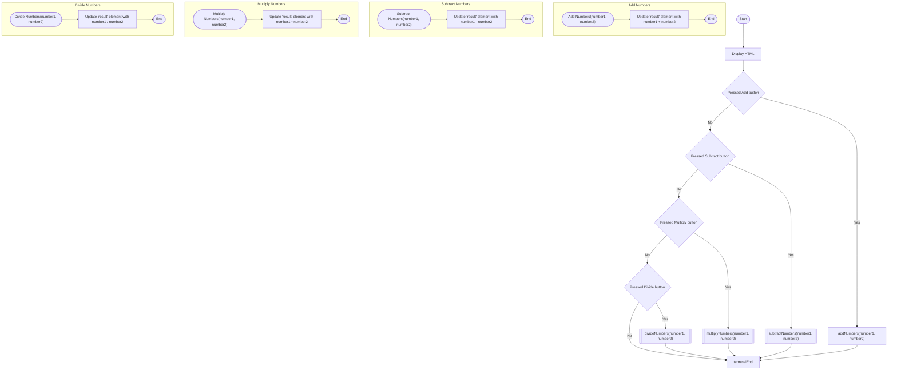
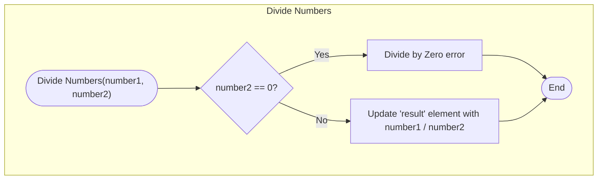

# Specific Implementation

You’ve already seen functions in javascript through this course.

The code sample shown here demonstrates a function called `loopCode()`.

```jsx
<!DOCTYPE html>
<html lang="en">
<head>
    <script>
            function loopCode() {
            
            }
    </script>
<title>Loop Code</title>
</head>
<body>

<h1>For Loops - Web Development</h1>

<p id="outputPosition"></p>

<form name='loopForm'>
    <button onclick="loopCode()" type="button">Run Loop</button>
</form>

</body>
</html>
```

This screenshots shows how a function is implemented in Javascript, within a HTML file. 

You’ll also notice the identification of where the function is *called* from. 


Javascript functions can also take advantage of parameters and return statements as well, just like other languages.


# Practical Exercises

## Code Logic

The page you’ll be creating is a simple calculator, which will allow the user to enter two numbers and then have the option of adding, subtracting, multiplying or dividing the two numbers.



## Code Implementation

Create a new HTML called `functions.html`. Replace the contents with this code.

The code has a form, with two input boxes named `firstNumber` and `secondNumber`. 

There are four buttons, which will eventually call one of the four functions that will be written - `addNumbers()`, `subtractNumbers()`, `multiplyNumbers()` or `divideNumbers()`.

```javascript
<!DOCTYPE html>
<html lang="en">
<head>
    <script>

    </script>
    <title>Functions Code</title>
</head>
<body>

<h1>For Loops - Web Development</h1>

<p id="result"></p>

<form name='loopForm'>
    <label><input id="firstNumber" type="number"></label>
    <label><input id="secondNumber" type="number"></label>
    <p></p>
    <button onclick="addNumbers(form.firstNumber.value, form.secondNumber.value)" type="button">Add Numbers</button>
    <button onclick="subtractNumbers(form.firstNumber.value, form.secondNumber.value)" type="button">Subtract Numbers
    </button>
    <button onclick="multiplyNumbers(form.firstNumber.value, form.secondNumber.value)" type="button">Multiply Numbers
    </button>
    <button onclick="divideNumbers(form.firstNumber.value, form.secondNumber.value)" type="button">Divide Numbers
    </button>
</form>

</body>
</html>
```


Create the `addNumbers` function. In the `<script>` tags, create a new function called `addNumbers`, which accepts two parameters - `number1` and `number2`.

```jsx
function addNumbers(number1, number2) {
            
}
```


The function needs to add `number1` and `number2` together and update the tag with the id `result` in the HTML. This can be done in one line of code.

```jsx
document.getElementById("result").innerHTML = parseInt(number1) + parseInt(number2);
```


Test the code at this stage - load the page in the browser. Enter two values in the form and press the Add Numbers button.


Include the remaining functions, which at this stage are extremely similar to the `addNumbers` function. 

```jsx
<script>
    function addNumbers(number1, number2) {
        document.getElementById("result").innerHTML = parseInt(number1) + parseInt(number2);
    }
    function subtractNumbers(number1, number2) {
        document.getElementById("result").innerHTML = parseInt(number1) - parseInt(number2);
    }
    function multiplyNumbers(number1, number2) {
        document.getElementById("result").innerHTML = parseInt(number1) * parseInt(number2);
    }
    function divideNumbers(number1, number2) {
        document.getElementById("result").innerHTML = parseInt(number1) / parseInt(number2);
    }
</script>
```


Test the page again and ensure that the code works correctly.

## Divide by Zero

The code works, in most situations. The main potential issue is if the user attempts to divide by zero.

It would be best to update the `divideNumbers()` function to catch that error before any calculation is performed, and present the user with a more useful error.

The flowchart for that function would need to be updated to:




Add an if statement to check if number2 is a zero.

```jsx
function divideNumbers(number1, number2) {
    if (number2 == 0) {
        document.getElementById("result").innerHTML = "Divide by Zero Error";

    }else {
        document.getElementById("result").innerHTML = parseInt(number1) / parseInt(number2);

    }
}
```


# Review

1. Update the calculator code to use only one function, rather than the original 4. The function would need to take 3 parameters - number1, number2 and operation. The operation would be either “add”, “subtract”, “multiply” or “divide”. The function would need to check (using an if) what the operation is, and perform the appropriate calculation.
2. What is the difference between arguments and parameters?
3. How many parameters can a function have?
4. Can a function have no parameters yet still return a value?
5. How many values can a function return at one time?

[Key Terms](Key%20Terms%20f21827aa598c4f4088047f98879161af.csv)