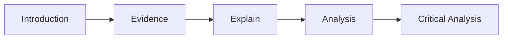

# Assessment Examples

Below are some examples of Assessments that students have submitted in the past. Use them as suggestions or inspirations for what you can develop.

[Meet Google Drive - One place for all your files](https://drive.google.com/drive/folders/1g8jxVFm5FgpJ-CkK8mPSGcsTDPCbzMf4?usp=sharing)

# Documentation Structure Example
These examples can be used as a guide on how to structure your responses in written tasks.

## Format Template

For each entry in the rubric, you can follow this basic template for a response



So this *could* equate to

1. Include a screenshot of code.

2. Explaining ‘how it works’ (Analysis), using technical language and linking it to other code or resources (research). You may also delve into explaining the technical details involved (again, research)

3. Critical Analysis (or Evaluation). Look at what you have submitted/discussed, and then evaluate it whether it solves the problem that was required or what you were attempting to solve. Compare and contrast to other options for solving the same problem.


## Robotics - Micro SD Card Module

The Micro SD Card module in this project (below) is Serial Peripheral Interface (SPI) module which enables an Arduino, and other Microcontrollers, to read and write data to micro SD cards.

![[assessmentSupportMicroSD.png]]

### Wiring

Different from the other components in this project, this device communicates over SPI, which is a specific communications protocol requiring specific pins to be used on the Arduino. The SPI pins for the Arduino Uno and Mega are shown here.

| Pin  | Uno | Mega |
| ---- | --- | ---- |
| MISO | 12  | 50   |
| MOSI | 11  | 51   |
| SCK  | 13  | 52   |
| CS   | 10  | 53   |

Therefore the *logical* wiring diagram for this module is:
![[assessmentSupportMicroSDWiring.png]]


### Code

The Arduino code required to enable this module is:

Configuration

```arduino
// SD Card Module

#include <SPI.h>
#include <SD.h>

// SD Card
#define SDpin 10

// Real Time Clock (RTC)
#include "RTClib.h"
RTC_Millis rtc; // Software Real Time Clock (RTC)
DateTime rightNow; // used to store the current time.
```

`Setup()`

```arduino

// SD Card initialisation
Serial.print("Initializing SD card...");
if (!SD.begin(SDpin)) {
	Serial.println("initialization failed!");
	while (1);
}

// Real Time Clock (RTC)
rtc.begin(DateTime(F(__DATE__), F(__TIME__)));
logEvent("System Initialisation Start");
```

`logEvent()`

```arduino
void logEvent(String dataToLog) {
	/*
	Log entries to a file on an SD card.
	*/
	
	// Get the updated/current time
	DateTime rightNow = rtc.now();
	
	// Open the log file
	File logFile = SD.open("events.csv", FILE_WRITE);
	if (!logFile) {
	Serial.print("Couldn't create log file");
	abort();
	}
	
	// Log the event with the date, time and data
	logFile.print(rightNow.year(), DEC);
	logFile.print(",");
	logFile.print(rightNow.month(), DEC);
	logFile.print(",");
	logFile.print(rightNow.day(), DEC);
	logFile.print(",");
	logFile.print(rightNow.hour(), DEC);
	logFile.print(",");
	logFile.print(rightNow.minute(), DEC);
	logFile.print(",");
	logFile.print(rightNow.second(), DEC);
	logFile.print(",");
	logFile.print(dataToLog);
	// End the line with a return character.
	logFile.println();
	logFile.close();
	Serial.print("Event Logged: ");
	Serial.print(rightNow.year(), DEC);
	Serial.print(",");
	Serial.print(rightNow.month(), DEC);
	Serial.print(",");
	Serial.print(rightNow.day(), DEC);
	Serial.print(",");
	Serial.print(rightNow.hour(), DEC);
	Serial.print(",");
	Serial.print(rightNow.minute(), DEC);
	Serial.print(",");
	Serial.print(rightNow.second(), DEC);
	Serial.print(",");
	Serial.println(dataToLog);
}

```

### Analysis

In these three snippets of code, you can see that the required libraries are included in the sketch and the Cable Select (CS) pin is set to 10. This is set as a variable to be used in the `setup()` function code - `SD.begin(SDpin)` - so that the code can be easily modified to use a different pin. This is useful if the project had to be modified to use a different microcontroller board, such as the Arduino Mega.

The configuration also utilises the Real Time Clock (RTC) library. While this is not strictly required for the SD card module to function, this allows the code to timestamp the events with the correct time. This project does not have a hardware RTC module, therefore the RTC is a software simulated version, where the time is set when the code is compiled and uploaded to the Arduino.

The `setup()` function attempts to interface with the SD card module on the indicated pin. If there is no SD card module detected, the sketch stops executing and doesn’t proceed. If an SD card is detected, the setup() function continues executing.

The software RTC is achieved through this line of code -`rtc.begin(DateTime(F(__DATE__), F(__TIME__)));`

The `logEvent()` function is used throughout the code to write timestamped events to the SD card. For debugging, it also outputs to the Serial Monitor, however this can easily be disabled to improve execution speed or to free resources.

Each event is logged in the following format:

`YYYY,MM,DD,HH,MM,SS,Event`

This format is compatible with the Comma Separated Values (CSV) format which can be opened in any spreadsheet application for analysis.
![[assessmentSupportMicroSDLog.png]]

As can be seen from the CSV output, the events are logged and can be used in an audit, or for forensic analysis for security issues.

### Critical Analysis / Evaluation

> This would require more research and detail.

The project works and achieves the goals set up - log each event in the system as required. In this project, the log is written to a local SD card, making this system airgapped with no internet connectivity.

One improvement to the system could be connecting the microcontroller to the internet and upload the events to an external server. This would require a few changes and considerations. First the project as it stands cannot connect to the internet as the Arduino Uno does not have this functionality. A wifi Shield or module could be added to the project, such as this one:

[https://docs.arduino.cc/retired/getting-started-guides/ArduinoWiFiShield](https://docs.arduino.cc/retired/getting-started-guides/ArduinoWiFiShield)

This may require rewiring of the modules, and may not be possible if other pins are required. An Arduino Mega could be used to allow for this, but testing would need to be done.

Another option is change to a platform that has internet connectivity built in, such as the Adafruit ESP32 Feather, or Raspberry Pi.

One of the biggest issues with the SD card module that it appears to cause conflicts with other SPI module connected to the board, specifically in the case of the provided Bluetooth module - the nrf8001 module. According to research, the MicroSD card module used is not 100% compatible with the SPI protocol. In effect, when the SD card module is wired into the circuit, the bluetooth module does not broadcast. Other SPI modules may have similar issues, but further testing is required.

### References

[https://www.tutorialspoint.com/spi-in-arduino-uno#:~:text=ArduinoSoftware %26 CodingHardware,that uses SPI for communication](https://www.tutorialspoint.com/spi-in-arduino-uno#:~:text=ArduinoSoftware%20%26%20CodingHardware,that%20uses%20SPI%20for%20communication).

[https://tronixstuff.com/2011/05/13/tutorial-arduino-and-the-spi-bus/](https://tronixstuff.com/2011/05/13/tutorial-arduino-and-the-spi-bus/)

[http://elm-chan.org/docs/mmc/mmc_e.html](http://elm-chan.org/docs/mmc/mmc_e.html)

## Robotics - Arduino Route
The default `/dashboard.html` route is:

![[assessmentSupportRoute.png]]


This contains a lot of information in the few short lines. Let’s analyse it.

First this route will execute (run) if the user attempts to access `dashboard.html`.

The first code that is executed is to check to see if the user has not authenticated yet.

The authentication is based on username and password, which are defined by the `http_username` and `http_password` variables defined in `sensitiveInformation`.

If the user hasn’t been authenticated with `http_username` and `http_password`, the server will send a message to the browser to collect that information.

Once authenticated, the system logs the event by running logEvent()

The server then sends `dashboard.html` to the browser.

False here indicates the the file is **not** set to download. If you wish the file to prompt to download (such as with the log file), this would be set to `true`.

Finally, processor is a function that will be run before the file (dashboard.html) is sent back to the browser.

## Robotics - Project

### Database Structure

The project relies on the efficient design and implementation of the database. From a pure technical point of view, the project complete is defined by the database, and the all other aspects of the project (website, Adafruit Feathers etc) are simply interfaces to the database.

> “The database is the project”, Ryan Cather 2024.

The database is divided into several tables, for the Users, challenges and Modules and others.
![[assessmentSupportDB.png]]

### User Table

This table stores the information on the users, enabling them to authenticate, and store their score and access levels.

User’s authenticate in the system with their **Username** and **Password**. When the user logs in, their AccessLevel and Score are loaded into session variables as well. Details of this process are here <link>.

The **HashedPassword** field is possibly the most important, particularly from a security standpoint. While the field is simply set to TEXT, and contain the password in cleartext, the system has been designed so that the passwords are encrypted using a one-way hash algorithm. An snapshot of the database is:
![[assessmentSupportDBUsers.png]]

What algorithm to encrypt the passwords.

Referecnes


[https://www.php.net/manual/en/function.password-hash.php](https://www.php.net/manual/en/function.password-hash.php)

### Challenges

### Modules

### Miscellaneous

## Website Development
The website developed - Ngunnawal Country - has been written in Python, using the Flask framework and heavily utilises the common Bootstrap library.
![[assessmentSupportHomePage.png]]

The screenshot shows only some of the functionality through it’s navigation bar. The implemented functionality includes:

| Unregistered Users | Registered Users (includes all Unregistered Users functionality) | Administrators (includes all Registered Users functionality) |
| --- | --- | --- |
| Home | Reset Their Password | View All Contact Messages |
| History | | List All Users |
| Contact Us | | Reset other users account |
| Gallery | | Enable / Disable Users |
| Registration | | |
| Login | | |

### User Management

One of the more complex modules of the website is the User Management system. This includes:

- User Registration
- User Login
- 
- User Logout
- Password Reset
- User Level

These functions are supported by the User table in the database, as is visualised here.
![[assessmentSupportUser.png]]

The fields shown contain all the information for each user to be able to perform any of the User Management functions.

As with Flask’s approach to database connections, a model **is defined in code to match the database table. The model implemented in this project appears as:
![[assessmentSupportUserClass.png]]


Not only does the class contain variables to store the relevant fields in the database, but helper functions have been developed to assist the main code (app.py) to perform common functions regarding the user. For instance, `set_password` and `check_password` functions are used registering and logging in, to standardise the process of hashing the password before storing or checking what the user entered. This process is explained in the “Password Hashing” section.

### Password Hash

From a security aspect, the password hash is the most important field in the table as it securely stores the users password. If an unauthorised person gained access to the database, they wouldn’t be able to read the password.

This project utilises the [werkzeug.security](http://werkzeug.securityhttps://werkzeug.palletsprojects.com/en/2.3.x/utils/) library which is best-practice for Flask projects, providing the `generate_password_hash()` and `check_password_hash()` functions. By default, the one-way algorithm used to generate and check password hashes is `scrypt`.


## Interactive Software Development
### Gameplay / Game Mechanics

#### Points

The points mechanic in this game is used to track the skill of the player, with the potential to compare it against other playthroughs. Currently, when the player successfully kills an enemy, they gane 10 points, as can be seen in the bullet.gd code sample below. The players score is stored in Global.gd - This script (referred as a singleton) is different from other scripts in the game in so much that it is **not** attached to any node, and the values stay in memory thoughout the execution of the game regardless of any change of scene or nodes in the game.
![[assessmentSupportGlobalScoringInformation.png]]


Global.gd
![[assessmentSupportGlobalAdd.png]]

bullet.gd
![[assessmentSupportBullet.png]]

In Godot
![[assessmentSupportPointsMechanic.gif]]

In game

While the score is stored in scoringInformation in Global.gd, the score is updated through bullet.gd. Each bullet **instance** moves in a certain direction (in this case vertically), if it **collides** with an object, the code then checks to see if “Enemy” is the name of that object. All enemy nodes in the project start with the word “Enemy” for instance “Enemy1”.

If the object does have “Enemy” in the game, then 10 points is added to the `currentScore` entry in the `scoringInformation` dictionary in Global.gd.

Currently, the Heads Up Display (HUD) does not accurately update the players score. How this could be fixed is similiar to the working Counttimer timer code in MainGame.gd
![[assessmentSupportPlayerScript.png]]

Instead of updating the HUD in _ready() (which only runs when the node first loads), the code could be placed in _process() which runs every frame refresh.

As the scoringInformation variable is stored in `Global.gd` this information stays in memory throughout the execution of the game, meaning that needs to be reset on each play through.

#### Health

#### Player Shooting

### Enemies

#### Enemies Shooting

etc etc.

# Past Assessments

## Project Analysis

[https://docs.google.com/document/d/1PqASpoohBheEiUjU2tZvqs4cs_5lF6ttxBO0GlVhwzU/edit?usp=drive_web](https://docs.google.com/document/d/1PqASpoohBheEiUjU2tZvqs4cs_5lF6ttxBO0GlVhwzU/edit?usp=drive_web)

[https://drive.google.com/file/d/1XIH5EaND66qn8YTDQyDuOgrD8W7tUqmH/view?usp=drive_web](https://drive.google.com/file/d/1XIH5EaND66qn8YTDQyDuOgrD8W7tUqmH/view?usp=drive_web)

- Tutorials

## Tutorials

### Written Tutorials

[Arduino Beginners Tutorial.pdf](https://drive.google.com/file/d/1gD2ceioAd4viYx7jen4Z23dN_3w51efg/view?usp=drivesdk)

[Arduino Fan Tutorial.pdf](https://drive.google.com/file/d/1gIcqCHKCtEFjv7Wp858mwQjn1z4WAjm2/view?usp=drivesdk)

[WebLamp.pdf](https://drive.google.com/file/d/1gD-81yoHfeBd11TqLmUxtdLkfREHjgIN/view?usp=drivesdk)

### Video Tutorials

[Windmill Tutorial Final.mp4](https://drive.google.com/file/d/1tgaLjwZQJ_KB3K6jSgDQzuq1jeHTT4hc/view?usp=drivesdk)

[RPi Robotics Tutorial 1.mp4](https://drive.google.com/file/d/1lRRHFw6kR-mhn_8VDF_yroI9PQekIp_6/view?usp=drivesdk)

[Database Configuration.mp4](https://drive.google.com/file/d/15hY3msOr6PbaEBT1mbsNBvsaIIzp9GGS/view?usp=drivesdk)

[RPi Robotics Tutorial 2.mp4](https://drive.google.com/file/d/1lUUNGEqxQL6vhbfeT3WAdH1R6Fh6g_zT/view?usp=drivesdk)

[Traffic Light Tutorial.mp4](https://drive.google.com/file/d/1tnVZSRO9D32K1BejqeRa3FXljrdiDTCy/view?usp=drivesdk)

[RPi Robotics Tutorial 3.mp4](https://drive.google.com/file/d/1lXi7TE0uahXAZ__-5nWQnoy_awzDeZ5o/view?usp=drivesdk)

- Project Presentations

## Project Presentations

[ProjectDone.mp4](https://drive.google.com/file/d/1TJv3TXDdRhYN_FEEOFj_WBfk6zBiXTaO/view?usp=drivesdk)

- Pitches

## Pitches

[DHS - TJC Corp.MOV](https://drive.google.com/file/d/1EoN1FbeE9oUitjT2HZWTUkMBiwx5S4M0/view?usp=drivesdk)

[DHS - Programme Summary.MOV](https://drive.google.com/file/d/11xDTpjBZkkUJ33Z421ioACG_OcjmYC1G/view?usp=drivesdk)

[DHS - Project Ransom.MOV](https://drive.google.com/file/d/1CeU14x86ttXg1WqaWrNZSCdmq7i0kRJY/view?usp=drivesdk)

[DHS - Dog Ate My Homework.MOV](https://drive.google.com/file/d/134lOZN7r8LR_i2i8j-cGUDeEfoXleCKQ/view?usp=drivesdk)

[Dope As Pirate Game Pitch](https://docs.google.com/presentation/d/1_FBu-oGvYnpIGhHsq7dGmxnQIGyrGrAL73Tl4X9BZpw/edit?usp=drivesdk)

[StoryBoard 1](https://docs.google.com/presentation/d/1T9XbcyMmofcyCUv0J2EqtFcNvwiTKKcoDq_Qpq9SvN4/edit?usp=drivesdk)

- Asset Creation Documents

## Asset Creation Documents

[2019 Asset Creation Documentation.pdf](https://drive.google.com/file/d/13SldrY6lHBXxZ-_vRI8EwMmhM5M1k3T-/view?usp=drivesdk)

## Game Design Documents

[2020S2 Game Design Document 2.pdf](https://drive.google.com/file/d/1AeiSUA1nzqVJy3gCtbeuBGSJSKUSR9kV/view?usp=drivesdk)

[https://docs.google.com/document/d/1Na5EUXgosmiNsmWXRqZgYWVV9qNOopmCVs969xy4j18/edit?usp=drive_web](https://docs.google.com/document/d/1Na5EUXgosmiNsmWXRqZgYWVV9qNOopmCVs969xy4j18/edit?usp=drive_web)

[2020S2 Game Design Document 1.pdf](https://drive.google.com/file/d/1AfM-LmS_EmBOLswncUhZLBlD1VPkv2FT/view?usp=drivesdk)

## Research and Development Reports

[Assessment 1 Example - Document](https://docs.google.com/document/d/1DsspbjnNE4WHbWFilVqcftQTV4g26jaoLXscPQy3MsA/edit?usp=drivesdk)

[Assessment 1 Example - Presentation Video.mkv](https://drive.google.com/file/d/15Uxg11famTPto2CEIecLtOWuLi2tNRY_/view?usp=drivesdk)

## DevLogs

[2021S2 ISD Digital Applications DevLog](https://docs.google.com/document/d/16y2O-8V6yRIIQtSY1b8KN_gJULRiLtvef-ycfe3j7Go/edit?usp=drivesdk)

[2021S2 ISD Digital Applications DevLog.webm](https://drive.google.com/file/d/1GjOKd-kT-nzKC1sCzYhowC0cNf2MLxcj/view?usp=drivesdk)

[2021S1 Robotics develeopment log](https://docs.google.com/document/d/1Co8je1hTJBaLZScCSbPX_3Ge7ltpcqWRKwk06bP5O3s/edit?usp=drivesdk)

## Implementation Reports

[Riya GAITONDE - Assessment 2 - Implementation](https://docs.google.com/document/d/1z6Jp_pgAilYnqtPvzhcXaUtmksE5axn-lephvCbrUeE/edit?usp=drivesdk)

[Jimmy BELL - 2020S2 Negotiated Study - Robotics - Design Document.pdf](https://drive.google.com/file/d/1sw9_sTigehK1Hwt9niv1dm1hDzsvBCGc/view?usp=drivesdk)

## Project Status / Evaluation Report Examples

[https://docs.google.com/document/d/1oJygxjwUf-8Hvis3sl2UhweR63zUQkRFFkFnE-zHm-c/edit?usp=sharing](https://docs.google.com/document/d/1oJygxjwUf-8Hvis3sl2UhweR63zUQkRFFkFnE-zHm-c/edit?usp=sharing)

[https://docs.google.com/document/d/1I9AtVV8XFetx0Eb7IknDy7PSbBwH-PUCH_cvWTaDuME/edit?usp=sharing](https://docs.google.com/document/d/1I9AtVV8XFetx0Eb7IknDy7PSbBwH-PUCH_cvWTaDuME/edit?usp=sharing)

[https://docs.google.com/document/d/1Tp8oH5hnXn0-3cFgsJeglwAnRSUbsfDt42J8p8FOnYs/edit?usp=sharing](https://docs.google.com/document/d/1Tp8oH5hnXn0-3cFgsJeglwAnRSUbsfDt42J8p8FOnYs/edit?usp=sharing)

## Evidence Guide

[https://docs.google.com/document/d/1faBNQQXyw4xl0oJERrqoqKToDEeC6OTg9F5SSMn9qmw/edit?usp=drive_web](https://docs.google.com/document/d/1faBNQQXyw4xl0oJERrqoqKToDEeC6OTg9F5SSMn9qmw/edit?usp=drive_web)

[https://docs.google.com/document/d/1ybv8rVjklAQwO1osHvAGaE9e2nEg4c2htWpkAvlTc1A/edit?usp=drive_web](https://docs.google.com/document/d/1ybv8rVjklAQwO1osHvAGaE9e2nEg4c2htWpkAvlTc1A/edit?usp=drive_web)

[https://docs.google.com/document/d/1koAXET19RLrCWzq7Puh65mvDIIipd0edyEaoQ9DlTG4/edit?usp=drive_web](https://docs.google.com/document/d/1koAXET19RLrCWzq7Puh65mvDIIipd0edyEaoQ9DlTG4/edit?usp=drive_web)

[https://drive.google.com/file/d/1gC8hJOgwXQPO4q13kt1x9K8ROReoSoie/view?usp=drive_web](https://drive.google.com/file/d/1gC8hJOgwXQPO4q13kt1x9K8ROReoSoie/view?usp=drive_web)

### More Examples

[More Examples](https://drive.google.com/drive/folders/1T-87im-RHAXKlOvbtLl24ahA4hYlsxr_?usp=drive_link)
## Video Presentations

[Weather Station with Arduino Tutorial 720p.mp4](https://drive.google.com/file/d/1gF2sS2CrxlviPEDUx4pcn2inuSOuiISz/view?usp=drivesdk)

[RPi Robotics Tutorial 3.mp4](https://drive.google.com/file/d/1lXi7TE0uahXAZ__-5nWQnoy_awzDeZ5o/view?usp=drivesdk)

[RPi Robotics Tutorial 2.mp4](https://drive.google.com/file/d/1lUUNGEqxQL6vhbfeT3WAdH1R6Fh6g_zT/view?usp=drivesdk)

[RPi Robotics Tutorial 1.mp4](https://drive.google.com/file/d/1lRRHFw6kR-mhn_8VDF_yroI9PQekIp_6/view?usp=drivesdk)

[https://drive.google.com/file/d/1tgaLjwZQJ_KB3K6jSgDQzuq1jeHTT4hc/view?usp=drive_web](https://drive.google.com/file/d/1tgaLjwZQJ_KB3K6jSgDQzuq1jeHTT4hc/view?usp=drive_web)

## More Examples

See here for more examples.

[](https://drive.google.com/drive/folders/1Jf6nOMkLRfz0zAtuinpARsQeJbSrfT9n?usp=drive_link)
