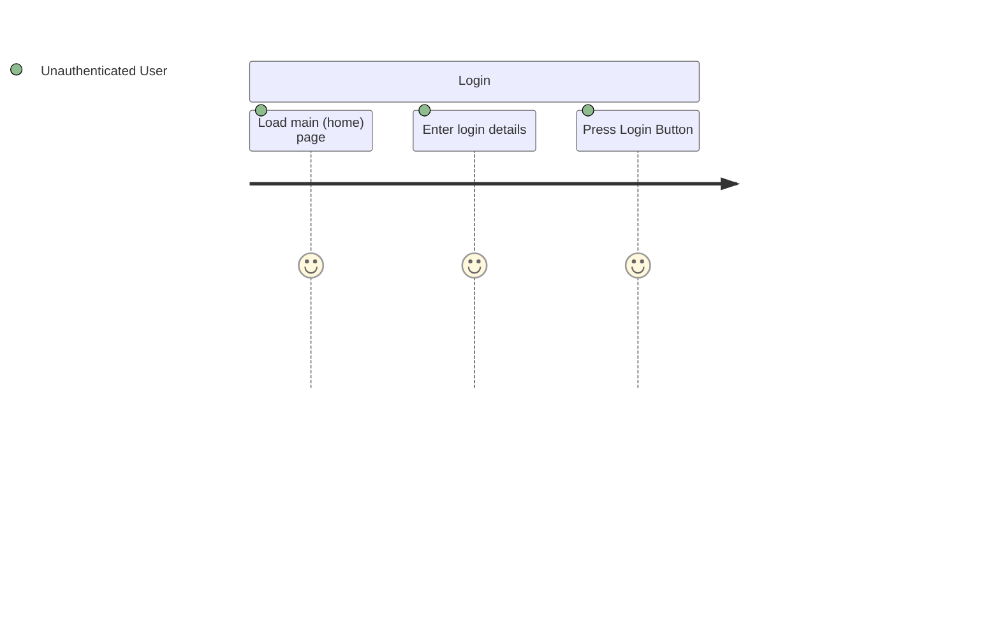

> [!Note] The implementation of this may differ depending on the IDE (Visual Studio Code, PHPStorm etc) being used.

A **User Journey** diagram shows the step in which a user goes through in a typical section process. Each step of the process is documented, and the “Actor” or user is indicated.

For example, in this _very simple_ login process, the User Journey could appear similar to this.

This diagram shows that the unauthenticated user performs the various steps - load the main site, enter details etc. Then the user becomes a Authenticated User and performs various actions, and then during logoff, they become unauthenticated again.


```mermaid
journey
title Login / Log off
    section Login
        Load main (home) page: 5: Unauthenticated User
        Enter login details: 5: Unauthenticated User
        Press Login Button: 5: Unauthenticated User
    section Registered
        Perform site Actions:5: Authenticated User
    section Logoff
        Press Logoff Button in Navbar:5: Authenticated User
        Close Browser:5: Unauthenticated User
````


To create your User Journey, 

1. map out the various processes that the user goes through, for instance login, User Registration, Product Registration, etc. Each of these would be their own diagram.
2. Identify the various Actors (users) that would be involved in that process.
3. Break the process down into various steps.

---

## Creating a User Journey diagram in Mermaid

In a markdown file (with the extension `.md`), start a mermaid chart section by including the start and end code.

Change the title to an appropriate heading.

```mermaid
journey
	title User Journey

```


A user journey diagram can be built up of various **sections**. Each section can have multiple steps. The basic syntax for a section is shown here.

The syntax for each step is:

`Task name: <score>: <comma separated list of actors>`



The score is an indication of what would frustrate the users (1) or if the step would make the user very happy (5).

---

The official reference for a User Journey diagram can be found here.

[User Journey Diagram | Mermaid](https://mermaid.js.org/syntax/userJourney.html)