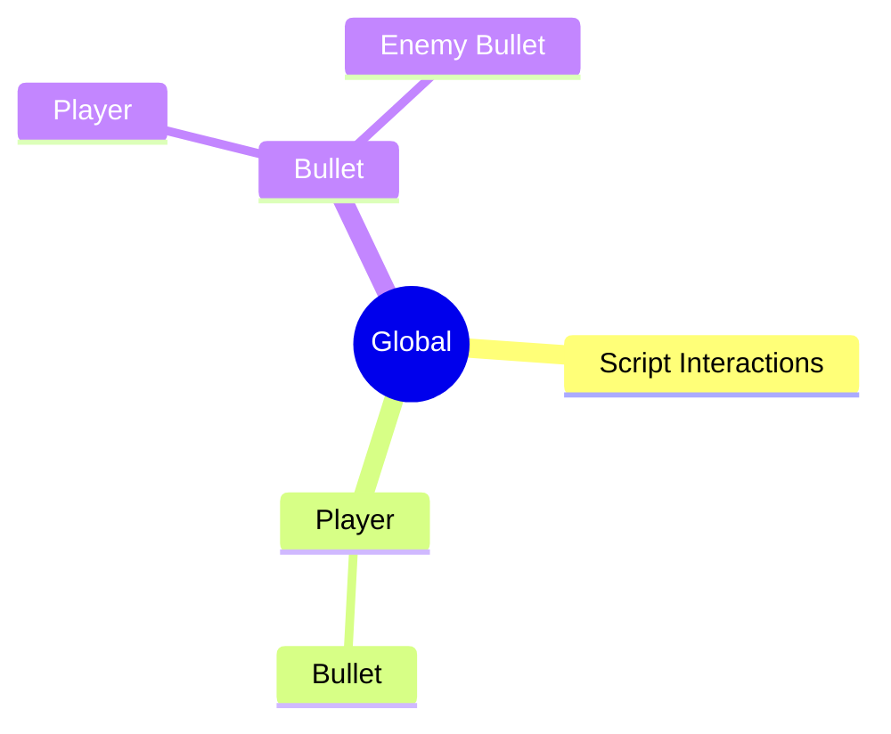

# Structure of Technical Report

The Analysis is to be written as a technical report and should be structured as such.

Here are some resources to assist you.

At a minimum, your document should have the following sections:

- Title page
- Table of Contents
- Introduction
- Summary
- Body
    
    <aside>
    ‼️ This section can be split into different sections depending on the purpose of the report.
    
    </aside>
    
- Conclusion

[Technical report writing](https://students.unimelb.edu.au/academic-skills/explore-our-resources/report-writing/technical-report-writing)

[How to Write Technical Report](https://medium.com/technical-writing-is-easy/how-to-write-technical-report-e935210002c9)

[https://www.youtube.com/watch?v=QJ3bZeF1AKg](https://www.youtube.com/watch?v=QJ3bZeF1AKg)

# Diagrams

Your technical report will need some diagrams to explain the system to the readers.

For the assessment task, you are required to include Use Case Diagrams to explain the functionalities, and Webpage Wireframes to show examples of the interfaces that the users will have access to.

## Use Case Diagrams

> The purpose of a use case diagram in UML is to demonstrate the different ways that a user might interact with a system.
[https://www.lucidchart.com/pages/uml-use-case-diagram](https://www.lucidchart.com/pages/uml-use-case-diagram)
> 

> Use case diagrams are used to gather the requirements of a system including internal and external influences.
[https://www.tutorialspoint.com/uml/uml_use_case_diagram.htm](https://www.tutorialspoint.com/uml/uml_use_case_diagram.htm)
> 

> “…the purposes of use case diagrams can be said to be as follows −
- Used to gather the requirements of a system.
- Used to get an outside view of a system.
- Identify the external and internal factors influencing the system.
- Show the interaction among the requirements are actors.”
> 

### Examples

### How to Create your own Use Case Diagrams

Using [diagrams.net](http://diagrams.net) or a similar app, create a Use Case Diagram for the proposed system.

### **How to Draw a Use Case Diagram?**

[https://online.visual-paradigm.com/diagrams/tutorials/use-case-diagram-tutorial/](https://online.visual-paradigm.com/diagrams/tutorials/use-case-diagram-tutorial/)

A Use Case model can be developed by following the steps below.

1. Identify the Actors (role of users) of the system.
2. For each category of users, identify all roles played by the users relevant to the system.
3. Identify what are the users required the system to be performed to achieve these goals.
4. Create use cases for every goal.
5. Structure the use cases.
6. Prioritize, review, estimate and validate the users.

### Resources

[Use Case Diagram Tutorial ( Guide with Examples ) - Creately Blog](https://creately.com/blog/diagrams/use-case-diagram-tutorial/)

[https://www.youtube.com/watch?v=quS39HW_bVg](https://www.youtube.com/watch?v=quS39HW_bVg)

## Webpage Wireframes

Sketch the interfaces for:

1. Monitors view and access
2. Guests view and access
3. Other’s as required.

These sketches can be done on paper, or digitally through [diagrams.net](https://app.diagrams.net) or similar.

More Information here: [Website Wireframes](Design%206dd970530a3f4a668fb5adcecdfac517/Website%20Wireframes%20c6e8595356884137a4719d62dfd9ebb9.md) 

## Databases - Jetbrains Products

If you’re developing in a Jetbrains product, PHPStorm, Pycharm etc, and you’re using a database as part of the project, you can easily export a Entity Relationship Diagram (ERD) for the database.

In the database tab, right-click on the database and then select `Diagrams → Show Diagram`

Once the diagram appears, right-click on the background and choose `Export Diagram → Export to Image`.

Save the Image.

The diagram can then be used in any document that is required.

## Mindmap

You could use a mindmap diagram to organise data into categories or similar.

